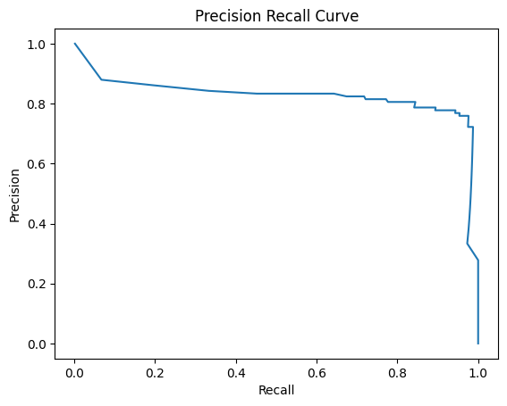
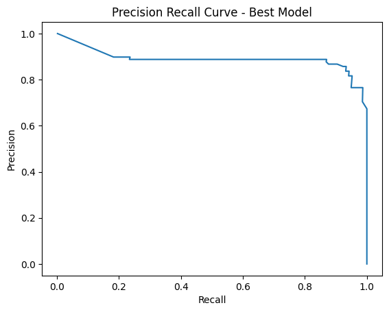

# icl-ml-portfolio

# CREDIT CARD FRAUD DETECTION

The project aim is to analyse a dataset containing both fraudulent and non-fraudulent credit card transactions and use this to build a machine learning model that can accurately predict a fraudulent transaction in the future. This is important to help minimise the number of customers and vendors who are negatively impacted on a daily basis by the large scale of global credit card fraud.
The project will use a number of techniques to attempt to make the performance of the model in detecting fraudulent cases as strong as possible. At the same time it is also vital that the model minimises the number of non-fraud cases it incorrectly identifies as fraud so that customers do not have legitimate transactions blocked.

## DATA
The dataset contains transactions made by credit cards in September 2013 by European cardholders. 

Data was obtained from Kaggle:
https://www.kaggle.com/datasets/mlg-ulb/creditcardfraud?resource=download

The dataset has been collected and analysed during a research collaboration of Worldline and the Machine Learning Group (http://mlg.ulb.ac.be) of ULB (Université Libre de Bruxelles) on big data mining and fraud detection.

This dataset presents transactions that occurred in two days, where there are just 492 frauds out of 284,807 transactions. The dataset is therefore highly unbalanced as the positive class (frauds) account for 0.172% of all transactions.\
It contains only numerical input variables which are the result of a Principle Component Analysis transformation (dimensionality reduction technique).\
Due to confidentiality issues, the original features and more background information about the data cannot be provided.
Features V1, V2, … V28 are the principal components obtained with PCA, the only features which have not been transformed with PCA are 'Time' and 'Amount'.

- Feature 'Time' contains the seconds elapsed between each transaction and the first transaction in the dataset.
- Feature 'Amount' is the transaction Amount, this feature can be used for example-dependant cost-sensitive learning.
- Feature 'Class' is the response variable and it takes value 1 in case of fraud and 0 otherwise.

## MODEL 
The model used will be a Random Forest Classifier (RFC) for the following reasons:

- Handles high-dimensional data (data with a large number of features). As credit card transactions often involve a large number of features relating to the buyer, vendor, amount, time and location this makes it a good candidate for a RFC.

- Handles imbalanced data: In credit card fraud detection, fraudulent transactions are typically rare compared to legitimate transactions, resulting in imbalanced data and this is very true in the chosen dataset. RFCs are capable of handling imbalanced data.

- Provides feature importance: RFCs provide a measure of feature importance, which can help in identifying the most important features in predicting fraudulent transactions. This information can then be used to help improve model performance.

- Reduces overfitting: Random Forest Classifier reduces overfitting by creating multiple decision trees and aggregating their results. This helps to improve the generalization performance of the model and prevent overfitting to the training data.

- High accuracy: Random Forest Classifier has been shown to achieve high accuracy in many classification tasks, including fraud detection in credit card transactions.

## HYPERPARAMETER OPTIMSATION
Hyperparameter Optimisation will be performed using Random Search, Grid Search and Bayesian Optimisation to then enable comparison of these different approaches. 
The hyperparameters to be tuned are the key parameters for building RFCs and are:
- Criterion : The function to measure the quality of a split [' Gini' or 'Entropy']
- n_estimators : The number of trees in the forest [range(10, 50)]
- max_depth : The maximum depth of the tree. If None, then nodes are expanded until all leaves are pure or until all leaves contain less than min_samples_split samples [None]
- max_features : The number of features to consider when looking for the best split [range(2, 10)]
- min_samples_split : The minimum number of samples required to split an internal node [range(2, 8)]
- min_samples_leaf : The minimum number of samples required to be at a leaf node. A split point at any depth will only be considered if it leaves at least min_samples_leaf samples in each of the left and right branches [range(1, 7)]
- bootstrap : Whether bootstrap samples are used when building trees. If False, the whole dataset is used to build each tree [True, False]

## RESULTS
Summary of the techniques deployed and their impact:

Undersampling enabled strong identification of feature importance but produced a highly overfitted model.

Oversampling gave the best performance.

Identifying low importance features enabled faster hyperparameter optimisation runs and then improved final model performance.

Removing outliers from the features with high importance to the target class did not have a positive effect. More work needed to see if this can be made to add value.

The performance metrics for each of the versions of the model are as per the following table:

The improvement in Area Under the Precision-Recall Curve can be seen by comparing the initial PR Curve against the final best model PR Curve:

You can include images of plots using the code below:

