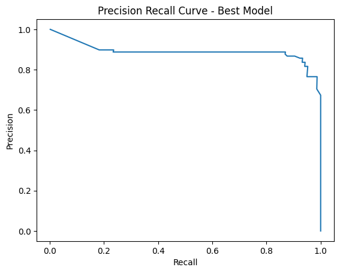

# Model Card

## Model Description

The model described in this card has been built to analyse a dataset containing both fraudulent and non-fraudulent credit card transactions and then accurately predict fraudulent transactions while minimising false positives.

The dataset is highly imbalanced as the positive class (frauds) account for just 0.172% of all transactions. Therefore techniques have been used to try and counter this imbalance and prevent the model overfitting for the majority class.

**Input:** 

The dataset inputs used to build the model contain only numerical input variables which are the result of a Principle Component Analysis transformation.
Due to confidentiality issues, the original features and more background information about the data cannot be provided. Features V1, V2, … V28 are the principal components obtained with PCA, the only features which have not been transformed with PCA are 'Time' and 'Amount'.

- Feature 'Time' contains the seconds elapsed between each transaction and the first transaction in the dataset.
- Feature 'Amount' is the transaction Amount, this feature can be used for example-dependant cost-sensitive learning.
- Feature 'Class' is the response variable a value 1 in case of fraud and 0 otherwise.

**Output:**

The model outputs a dataframe that shows the progression of the model building as different analysis, optimisation and overfitting reduction techniques are attempted.

The performance of each version of the model is determined through the following metrics:

- Precision = ratio of the number of true positives divided by the sum of the true positives and false positives. It describes how good a model is at predicting the positive class. Precision is referred to as the positive predictive value.

- Recall = the ratio of the number of true positives divided by the sum of the true positives and the false negatives. Recall is the same as sensitivity.

- F1 score = combines precision and recall into one metric. If precision and recall are both high, F1 will be high, too. If they are both low, F1 will be low. If one is high and the other low, F1 will be low. F1 is a quick way to tell whether the classifier is actually good at identifying members of a class, or if it is finding shortcuts (e.g., just identifying everything as a member of a large class).

- Area Under the Precision-Recall Curve (AUPRC) = recommended metric by the dataset owners due to the class imbalance. A high area under the curve represents both high recall and high precision, where high precision relates to a low false positive rate, and high recall relates to a low false negative rate

**Model Architecture:**

A Random Forest Classifier is used from the sklearn.ensemble Python package.

Other key packages are:
- sklearn.metrics.precision_recall_curve, auc = to determine the AUPRC metric
- sklearn.metrics.classification_report = to determine precision, recall and f1
- imblearn.over_sampling.RandomOverSampler = to undertake random oversampling
- sklearn.model_selection.RandomizedSearchCV, GridSearchCV = for hyperparameter optimisation
- hyperopt bayesian optimisation package for hyperparameter optmisation

## Performance

Final best model performance was measured on the full dataset with all of the original features split into 80/20 training and test. Time and Amount were scaled. The metric Area Under the Precision-Recall Curve (AUPRC) was used to determine the best performing model.

- Undersampling enabled strong identification of feature importance but produced a highly overfitted model.

- Oversampling gave the best performance.

- Identifying low importance features enabled faster hyperparameter optimisation runs and then improved final model performance.

- Removing outliers from the features with high importance to the target class did not have a positive effect. More work needed to see if this can be made to add value.

The performance metrics for each of the versions of the model are as per the following table (AUPRC is the key metric):

|index|Desc|Precision|Recall|F1|AUPRC|Reduced Features|Outliers Removed|Oversampled|Undersampled|Hyperparams Optimised|
|---|---|---|---|---|---|---|---|---|---|---|
|0|1st run - basic RFC|0\.943|0\.769|0\.847|0\.827|false|false|false|false|false|
|1|2nd run - Reduced Features|0\.912|0\.769|0\.834|0\.816|true|false|false|false|false|
|2|3rd run - Undersampled RFC|0\.044|0\.898|0\.084|0\.746|false|true|false|true|false|
|3|4th run - Oversampled RFC|0\.939|0\.786|0\.856|0\.87|false|false|true|false|false|
|4|5th run - Oversampled RFC|0\.952|0\.806|0\.873|0\.859|false|true|true|false|false|
|5|6th run - Random Opt|0\.169|0\.888|0\.283|0\.719|true|false|false|false|Random|
|6|7th run - Grid Opt|0\.251|0\.888|0\.391|0\.775|true|false|false|false|Grid|
|7|8th run - BO Opt|0\.951|0\.796|0\.867|0\.871|true|false|false|false|BO|
|8|9th run - Best Model|0\.942|0\.827|0\.88|0\.892|true|false|true|false|BO|

The improvement in Area Under the Precision-Recall Curve can be seen by comparing the initial PR Curve against the final best model PR Curve:

## Limitations

The model is limited by focusing on dealing with the imbalanced dataset rather than finding the best classifier model. Logistic regression, Neural Network or Support Vector Machine models may perform better in the actual classificaiton of fraud task.

## Trade-offs

A trade-off was made to reduce the dimensionality before running Hyperparameter optimisation. This was done due to limited compute power in the Google Colab runtimes and was necessary to keep the optimisation run time between 2-4 hours.

The decision on which features to remove was undertaken after close analysis of the feature correlation to the target class. The final best model was run on this reduced feature dataset to get the best performance however an outcome of removing these 17 features may have been to reduce the maximum performance of the optimisation runs and absolute best model output.
